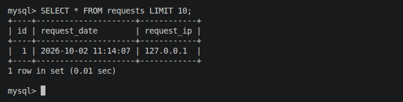
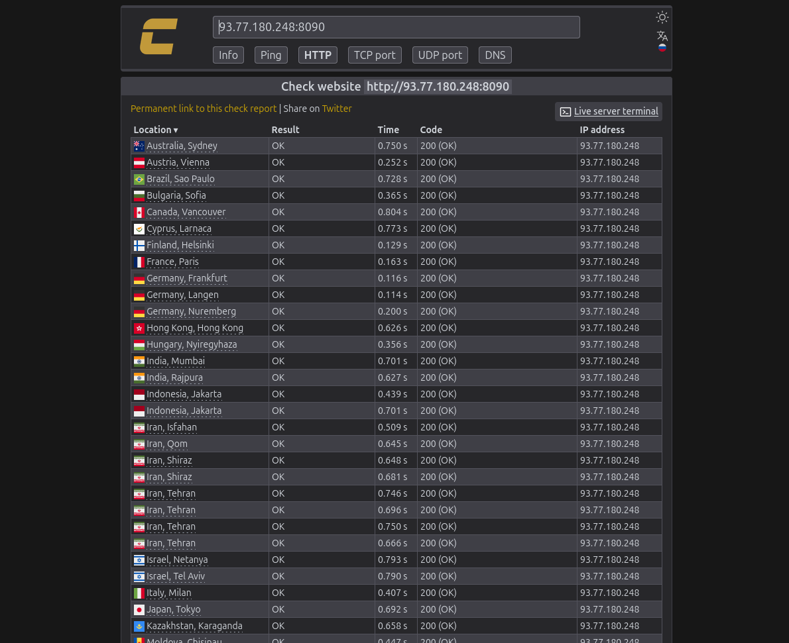
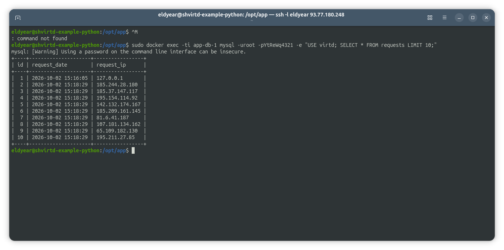
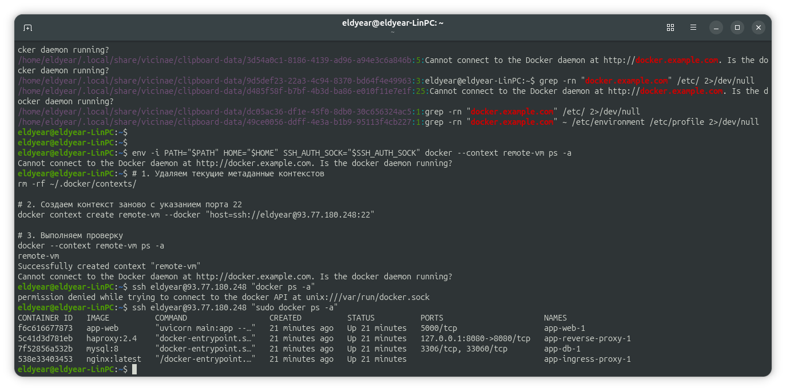
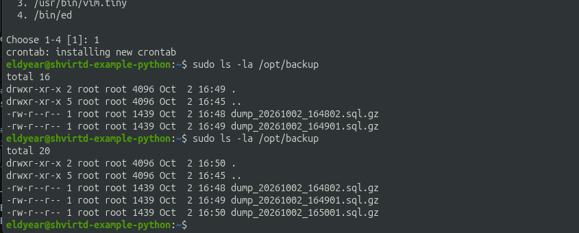
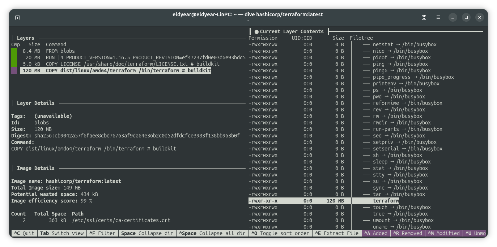
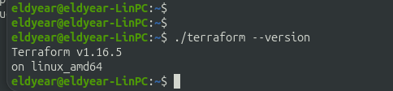

# Домашнее задание к занятию 5. «Практическое применение Docker» - Элдияр Акматов

[Ссылка на GitHub репозиторий](https://github.com/eldyear/shvirtd-example-python)

Задача 3: Проверка работы базы данных (SQL-запрос) и файл [compose.yaml](compose.yaml)
Команда подключения к MySQL:


```

docker exec -ti app-db-1 mysql -uroot -pPassword

```

SQL-запросы:

```

show databases;

use virtd;

show tables;

SELECT * from requests LIMIT 10;

```



Задача 4: Проверка на сервере Yandex Cloud
• Проверка через check-host: по цепочке `Пользователь → Internet → Nginx → HAProxy → FastAPI (запись в БД)`.




"Отобразите список контекстов и результат удаленного выполнения docker ps -a". Замучился с этим но Docker никак не захотел выролнить команду `docker --context remote-vm ps -a` выдавая одну и ту же ошибку 
```bash
Cannot connect to the Docker daemon at http://docker.example.com. Is the docker daemon running?
```
Так как это "Необязательная часть" решил оставить на потом но вывел с помошью команды `ssh eldyear@93.77.180.248 "sudo docker ps -a"` хотя это не правильно. (так утешился)



Задача 5: Автоматическое резервное копирование (/opt/backup)
• Скрипт бэкапа (/opt/backup.sh):

```

#!/usr/bin/env bash
set -eo pipefail

if [ -f /opt/app/.env ]; then
    export $(grep -v '^#' /opt/app/.env | xargs)
fi

APP_DIR="/opt/app"
BACKUP_DIR="/opt/backup"
TIMESTAMP=$(date +%Y%m%d_%H%M%S)
BACKUP_FILE="${BACKUP_DIR}/dump_${TIMESTAMP}.sql.gz"

# Бэкап через mysql:8 (или schnitzler/mysqldump с --default-auth=mysql_native_password)
sudo docker run --rm \
  --network app_backend \
  mysql:8 \
  mysqldump -h app-db-1 -u root -p"${MYSQL_ROOT_PASSWORD}" virtd | gzip > "${BACKUP_FILE}"

echo "Backup created successfully: ${BACKUP_FILE}"

```

• Cron-задача:

```

* * * * * /opt/backup.sh > /dev/null 2>&1

```



Задача 6: Извлечение бинарного файла Terraform
Окно `dive hashicorp/terraform:latest` с выделенным файлом `terraform`.



Терминал с выполнением команды `./terraform --version`.


